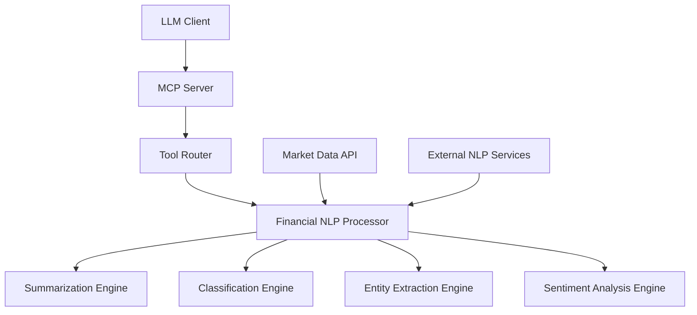

# FinanceNLP-MCP: Model Context Protocol Server for Financial Natural Language Processing

[](https://www.python.org/downloads/)
[](https://fastapi.tiangolo.com/)
[](https://opensource.org/licenses/MIT)
[](https://modelcontextprotocol.io/)

A production-ready Model Context Protocol (MCP) server that enables standardized Large Language Model integration with modular financial NLP tools. Built for parsing, analyzing, and extracting insights from both tabular and unstructured financial data.

## 🎯 Overview

FinanceNLP-MCP bridges the gap between LLMs and financial data processing by providing a standardized, extensible backend that supports multiple NLP tasks specific to financial domains. Whether you're processing earnings reports, market analysis, regulatory filings, or real-time financial news, this server provides the tools you need with a consistent API interface.

### Key Value Propositions

- **🔗 LLM Integration**: MCP-compliant architecture for seamless integration with language models
- **📈 Financial Domain Expertise**: Purpose-built NLP tools optimized for financial content
- **🔄 Multi-Format Support**: Handle tabular data, unstructured text, JSON, and more
- **⚡ Production Ready**: Built with FastAPI for high-performance, scalable deployments
- **🛠️ Extensible Design**: Modular architecture for easy customization and tool addition

## 🏗️ Architecture

### Model Context Protocol (MCP) Compliance

This server implements the Model Context Protocol specification, providing:

- **Standardized Request/Response Format**: Consistent API contract for LLM integration
- **Tool Discovery**: Dynamic tool registration and capability advertisement
- **Error Handling**: Robust error reporting with detailed metadata
- **Async Processing**: Non-blocking request handling for scalable performance

### Core Components



## 🚀 Quick Start

### Prerequisites

- Python 3.8 or higher
- pip package manager
- Internet connection (for market data and NLTK downloads)

### Installation

1. **Clone the repository**
   ```bash
   git clone https://github.com/yourusername/FinanceNLP-MCP.git
   cd FinanceNLP-MCP
   ```

2. **Create a virtual environment**
   ```bash
   python -m venv finance-nlp-env
   source finance-nlp-env/bin/activate  # On Windows: finance-nlp-env\Scripts\activate
   ```

3. **Install dependencies**
   ```bash
   pip install -r requirements.txt
   ```

4. **Run the server**
   ```bash
   python main.py
   ```

   The server will start on `http://localhost:8000`

### Docker Deployment

```bash
# Build the Docker image
docker build -t finance-nlp-mcp .

# Run the container
docker run -p 8000:8000 finance-nlp-mcp
```

## 📚 API Documentation

### Core MCP Endpoint

#### `POST /mcp/process`

The main MCP processing endpoint that handles all financial NLP tasks.

**Request Format:**
```json
{
    "tool_type": "summarization|classification|extraction|sentiment",
    "data_format": "text|json|tabular|unstructured",
    "input_data": "your_data_here",
    "parameters": {
        "max_length": 150,
        "custom_param": "value"
    },
    "context": "optional_context_information"
}
```

**Response Format:**
```json
{
    "success": true,
    "tool_type": "summarization",
    "result": {
        "summary": "Generated summary text...",
        "key_sentences": 3,
        "confidence": 0.85
    },
    "metadata": {
        "data_format": "text",
        "processing_time": "2024-01-15T10:30:00Z",
        "parameters_used": {"max_length": 150}
    },
    "timestamp": "2024-01-15T10:30:00Z"
}
```

### Tool-Specific APIs

#### 1. Financial Text Summarization

**Endpoint:** `POST /examples/summarize`

Generates concise summaries of financial documents using extractive summarization optimized for financial content.

**Features:**
- Financial keyword weighting
- Position-based sentence scoring
- Configurable summary length
- Confidence scoring

**Example:**
```bash
curl -X POST "http://localhost:8000/examples/summarize" \
  -H "Content-Type: application/json" \
  -d '{"text": "Apple Inc. reported record quarterly earnings of $123.9 billion in revenue, beating analyst expectations by 5%. The company saw strong growth in iPhone sales and services revenue, with CEO Tim Cook noting exceptional performance in international markets."}'
```

**Response:**
```json
{
    "success": true,
    "result": {
        "summary": "Apple Inc. reported record quarterly earnings of $123.9 billion in revenue, beating analyst expectations by 5%. The company saw strong growth in iPhone sales and services revenue.",
        "key_sentences": 2,
        "confidence": 0.92
    }
}
```

#### 2. Financial Text Classification

**Endpoint:** `POST /examples/classify`

Categorizes financial text into predefined financial domains.

**Categories:**
- `earnings_report`: Quarterly/annual earnings announcements
- `market_analysis`: Market trends and forecasts
- `company_news`: Corporate announcements and events
- `regulatory`: SEC filings and compliance matters
- `economic_indicator`: Economic data and indicators

**Example:**
```bash
curl -X POST "http://localhost:8000/examples/classify" \
  -H "Content-Type: application/json" \
  -d '{"text": "The Federal Reserve announced a 0.25% interest rate increase to combat rising inflation, marking the third rate hike this year."}'
```

**Response:**
```json
{
    "success": true,
    "result": {
        "primary_category": "economic_indicator",
        "confidence": 0.78,
        "all_scores": {
            "earnings_report": 0.0,
            "market_analysis": 0.2,
            "company_news": 0.1,
            "regulatory": 0.3,
            "economic_indicator": 0.78
        },
        "is_financial": true
    }
}
```

#### 3. Financial Entity Extraction

**Endpoint:** `POST /examples/extract`

Extracts structured financial entities from unstructured text.

**Extracted Entities:**
- Stock symbols (e.g., AAPL, GOOGL)
- Monetary amounts (e.g., $1.2B, $500M)
- Percentages (e.g., 15%, 0.25%)
- Dates (e.g., Q3 2024, Jan 15, 2024)
- Currency codes (USD, EUR, GBP, etc.)

**Example:**
```bash
curl -X POST "http://localhost:8000/examples/extract" \
  -H "Content-Type: application/json" \
  -d '{"text": "AAPL stock rose 3.5% after reporting $89.5 billion in revenue for Q1 2024, with strong performance in the EUR and USD markets."}'
```

**Response:**
```json
{
    "success": true,
    "result": {
        "companies": [],
        "currencies": ["EUR", "USD"],
        "amounts": ["$89.5 billion"],
        "dates": ["Q1 2024"],
        "percentages": ["3.5%"],
        "stock_symbols": ["AAPL"]
    }
}
```

#### 4. Financial Sentiment Analysis

**Endpoint:** `POST /examples/sentiment`

Multi-layered sentiment analysis combining general sentiment with financial domain-specific indicators.

**Analysis Layers:**
- VADER sentiment analysis
- TextBlob polarity/subjectivity
- Financial keyword weighting
- Combined confidence scoring

**Example:**
```bash
curl -X POST "http://localhost:8000/examples/sentiment" \
  -H "Content-Type: application/json" \
  -d '{"text": "The company exceeded profit expectations with strong growth in all segments, driving bullish investor sentiment."}'
```

**Response:**
```json
{
    "success": true,
    "result": {
        "overall_sentiment": "positive",
        "confidence": 0.87,
        "scores": {
            "vader": {
                "compound": 0.6696,
                "pos": 0.294,
                "neu": 0.706,
                "neg": 0.0
            },
            "textblob": {
                "polarity": 0.5,
                "subjectivity": 0.75
            },
            "financial_context": 0.125,
            "combined": 0.431
        }
    }
}
```

### Market Data Integration

#### `GET /market/quote/{symbol}`

Retrieve real-time market data for financial analysis.

**Example:**
```bash
curl "http://localhost:8000/market/quote/AAPL"
```

**Response:**
```json
{
    "symbol": "AAPL",
    "current_price": 175.43,
    "company_name": "Apple Inc.",
    "market_cap": 2847234000000,
    "pe_ratio": 28.15,
    "timestamp": "2024-01-15T15:30:00Z"
}
```

### System Endpoints

#### `GET /`
Server information and capabilities

#### `GET /health`
Health check endpoint for monitoring

#### `GET /tools`
List all available tools and their specifications

## 🔧 Configuration

### Environment Variables

Create a `.env` file in the project root:

```env
# Server Configuration
HOST=0.0.0.0
PORT=8000
LOG_LEVEL=info
WORKERS=1

# API Keys (if using external services)
ALPHA_VANTAGE_KEY=your_alpha_vantage_key
FINNHUB_KEY=your_finnhub_key

# Processing Configuration
MAX_SUMMARY_LENGTH=200
DEFAULT_CONFIDENCE_THRESHOLD=0.7

# Cache Configuration
REDIS_URL=redis://localhost:6379
CACHE_TTL=3600
```

### Custom Configuration

Modify the `FinancialNLPProcessor` class to customize:

- Financial keyword dictionaries
- Sentiment analysis weights
- Classification categories
- Entity extraction patterns

**Example customization:**
```python
class CustomFinancialProcessor(FinancialNLPProcessor):
    def __init__(self):
        super().__init__()
        self.financial_keywords.update({
            'crypto': ['bitcoin', 'ethereum', 'blockchain', 'cryptocurrency'],
            'esg': ['sustainability', 'carbon', 'green', 'environmental']
        })
```

## 🧪 Testing

### Unit Tests

```bash
# Run all tests
pytest tests/

# Run with coverage
pytest --cov=src tests/

# Run specific test categories
pytest tests/test_summarization.py
pytest tests/test_classification.py
pytest tests/test_extraction.py
pytest tests/test_sentiment.py
```

### Integration Tests

```bash
# Test MCP compliance
pytest tests/test_mcp_compliance.py

# Test API endpoints
pytest tests/test_api_endpoints.py

# Performance tests
pytest tests/test_performance.py
```

### Manual Testing

Use the interactive API documentation at `http://localhost:8000/docs` to test endpoints manually.

**Example test cases:**

1. **Earnings Report Processing:**
   ```json
   {
       "tool_type": "summarization",
       "data_format": "text",
       "input_data": "Microsoft Corporation today announced the following results for the quarter ended December 31, 2023, as compared to the corresponding period of last fiscal year: Revenue was $62.0 billion and increased 20% (up 19% in constant currency). Operating income was $27.0 billion and increased 23% (up 22% in constant currency). Net income was $22.3 billion and increased 33% (up 32% in constant currency). Diluted earnings per share was $2.93 and increased 33% (up 32% in constant currency)."
   }
   ```

2. **Market Analysis Classification:**
   ```json
   {
       "tool_type": "classification",
       "data_format": "text",
       "input_data": "Technical analysis suggests the S&P 500 is approaching a key resistance level at 4,800 points. Trading volume has been declining, and the RSI indicator shows overbought conditions. Analysts recommend caution in the near term."
   }
   ```

## 🔌 Integration Examples

### Python Client

```python
import asyncio
import aiohttp

class FinanceNLPClient:
    def __init__(self, base_url="http://localhost:8000"):
        self.base_url = base_url
    
    async def process_text(self, text, tool_type="summarization", **kwargs):
        async with aiohttp.ClientSession() as session:
            payload = {
                "tool_type": tool_type,
                "data_format": "text",
                "input_data": text,
                "parameters": kwargs
            }
            
            async with session.post(
                f"{self.base_url}/mcp/process",
                json=payload
            ) as response:
                return await response.json()

# Usage
async def main():
    client = FinanceNLPClient()
    
    # Summarize financial text
    result = await client.process_text(
        "Apple reported strong quarterly results...",
        tool_type="summarization",
        max_length=100
    )
    print(result)

asyncio.run(main())
```

### JavaScript/TypeScript Client

```typescript
interface MCPRequest {
    tool_type: 'summarization' | 'classification' | 'extraction' | 'sentiment';
    data_format: 'text' | 'json' | 'tabular' | 'unstructured';
    input_data: string | object | Array<any>;
    parameters?: Record<string, any>;
    context?: string;
}

class FinanceNLPClient {
    constructor(private baseUrl: string = 'http://localhost:8000') {}
    
    async processText(request: MCPRequest): Promise<any> {
        const response = await fetch(`${this.baseUrl}/mcp/process`, {
            method: 'POST',
            headers: {
                'Content-Type': 'application/json',
            },
            body: JSON.stringify(request),
        });
        
        return response.json();
    }
}

// Usage
const client = new FinanceNLPClient();

const result = await client.processText({
    tool_type: 'sentiment',
    data_format: 'text',
    input_data: 'The market showed strong bullish momentum today.',
});

console.log(result);
```

### LangChain Integration

```python
from langchain.tools import Tool
from langchain.agents import AgentExecutor, create_openai_functions_agent

def create_finance_nlp_tools(client):
    """Create LangChain tools from FinanceNLP-MCP client"""
    
    def summarize_financial_text(text: str) -> str:
        result = asyncio.run(client.process_text(text, "summarization"))
        return result['result']['summary']
    
    def analyze_financial_sentiment(text: str) -> str:
        result = asyncio.run(client.process_text(text, "sentiment"))
        sentiment = result['result']['overall_sentiment']
        confidence = result['result']['confidence']
        return f"Sentiment: {sentiment} (confidence: {confidence:.2f})"
    
    return [
        Tool(
            name="summarize_financial_text",
            description="Summarize financial documents and reports",
            func=summarize_financial_text
        ),
        Tool(
            name="analyze_financial_sentiment",
            description="Analyze sentiment of financial text",
            func=analyze_financial_sentiment
        ),
    ]
```

## 📊 Performance Optimization

### Caching Strategy

Implement Redis caching for frequently accessed data:

```python
import redis
import json
from functools import wraps

redis_client = redis.Redis(host='localhost', port=6379, db=0)

def cache_result(expiration=3600):
    def decorator(func):
        @wraps(func)
        async def wrapper(*args, **kwargs):
            # Create cache key from function name and arguments
            cache_key = f"{func.__name__}:{hash(str(args) + str(kwargs))}"
            
            # Try to get cached result
            cached = redis_client.get(cache_key)
            if cached:
                return json.loads(cached)
            
            # Execute function and cache result
            result = await func(*args, **kwargs)
            redis_client.setex(
                cache_key, 
                expiration, 
                json.dumps(result, default=str)
            )
            
            return result
        return wrapper
    return decorator
```

### Batch Processing

Process multiple texts in a single request:

```python
@app.post("/mcp/batch")
async def batch_process(requests: List[MCPRequest]):
    """Process multiple MCP requests in batch"""
    tasks = [ToolRouter.route_request(req) for req in requests]
    results = await asyncio.gather(*tasks)
    return {"batch_results": results}
```

### Async Processing

For long-running tasks, implement async processing with task queues:

```python
from celery import Celery

celery_app = Celery('finance_nlp')

@celery_app.task
def process_large_document(document_text, tool_type):
    """Process large documents asynchronously"""
    # Implementation here
    pass

@app.post("/mcp/async")
async def async_process(request: MCPRequest):
    """Submit async processing task"""
    task = process_large_document.delay(
        request.input_data, 
        request.tool_type
    )
    return {"task_id": task.id}
```

## 🔒 Security Considerations

### API Security

1. **Rate Limiting**
   ```python
   from slowapi import Limiter, _rate_limit_exceeded_handler
   from slowapi.util import get_remote_address
   
   limiter = Limiter(key_func=get_remote_address)
   app.state.limiter = limiter
   
   @app.post("/mcp/process")
   @limiter.limit("100/minute")
   async def process_mcp_request(request: Request, mcp_request: MCPRequest):
       # Implementation
   ```

2. **Input Validation**
   ```python
   from pydantic import validator
   
   class MCPRequest(BaseModel):
       # ... other fields ...
       
       @validator('input_data')
       def validate_input_size(cls, v):
           if isinstance(v, str) and len(v) > 100000:  # 100KB limit
               raise ValueError('Input data too large')
           return v
   ```

3. **Authentication**
   ```python
   from fastapi.security import HTTPBearer, HTTPAuthorizationCredentials
   
   security = HTTPBearer()
   
   async def verify_token(credentials: HTTPAuthorizationCredentials = Depends(security)):
       # Implement token verification
       pass
   ```

### Data Privacy

- Implement data encryption for sensitive financial information
- Add request/response logging controls
- Provide data retention policies
- Support GDPR compliance features

## 🚀 Deployment

### Production Deployment

#### Docker Compose

```yaml
version: '3.8'

services:
  finance-nlp-mcp:
    build: .
    ports:
      - "8000:8000"
    environment:
      - WORKERS=4
      - LOG_LEVEL=info
    depends_on:
      - redis
      - postgres
    
  redis:
    image: redis:7-alpine
    ports:
      - "6379:6379"
  
  postgres:
    image: postgres:15-alpine
    environment:
      POSTGRES_DB: finance_nlp
      POSTGRES_USER: finance_user
      POSTGRES_PASSWORD: secure_password
    ports:
      - "5432:5432"
    volumes:
      - postgres_data:/var/lib/postgresql/data

volumes:
  postgres_data:
```

#### Kubernetes Deployment

```yaml
apiVersion: apps/v1
kind: Deployment
metadata:
  name: finance-nlp-mcp
spec:
  replicas: 3
  selector:
    matchLabels:
      app: finance-nlp-mcp
  template:
    metadata:
      labels:
        app: finance-nlp-mcp
    spec:
      containers:
      - name: finance-nlp-mcp
        image: finance-nlp-mcp:latest
        ports:
        - containerPort: 8000
        env:
        - name: WORKERS
          value: "2"
        - name: LOG_LEVEL
          value: "info"
        resources:
          requests:
            memory: "512Mi"
            cpu: "250m"
          limits:
            memory: "1Gi"
            cpu: "500m"
---
apiVersion: v1
kind: Service
metadata:
  name: finance-nlp-mcp-service
spec:
  selector:
    app: finance-nlp-mcp
  ports:
  - port: 80
    targetPort: 8000
  type: LoadBalancer
```

### Monitoring and Observability

#### Prometheus Metrics

```python
from prometheus_client import Counter, Histogram, generate_latest

REQUEST_COUNT = Counter('finance_nlp_requests_total', 'Total requests', ['tool_type', 'status'])
REQUEST_DURATION = Histogram('finance_nlp_request_duration_seconds', 'Request duration')

@app.middleware("http")
async def add_prometheus_metrics(request: Request, call_next):
    start_time = time.time()
    
    response = await call_next(request)
    
    duration = time.time() - start_time
    REQUEST_DURATION.observe(duration)
    REQUEST_COUNT.labels(
        tool_type=getattr(request.state, 'tool_type', 'unknown'),
        status=response.status_code
    ).inc()
    
    return response

@app.get("/metrics")
async def metrics():
    return Response(generate_latest(), media_type="text/plain")
```

#### Health Checks

```python
@app.get("/health/live")
async def liveness_check():
    """Kubernetes liveness probe"""
    return {"status": "alive"}

@app.get("/health/ready")
async def readiness_check():
    """Kubernetes readiness probe"""
    # Check dependencies
    try:
        # Test database connection
        # Test external API availability
        return {"status": "ready"}
    except Exception as e:
        raise HTTPException(status_code=503, detail="Not ready")
```

## 🤝 Contributing

We welcome contributions! Please see our [Contributing Guide](CONTRIBUTING.md) for details.

### Development Setup

1. Fork the repository
2. Create a feature branch: `git checkout -b feature/amazing-feature`
3. Install dependencies: `pip install -r requirements-dev.txt`
4. Make your changes
5. Run tests: `pytest`
6. Commit changes: `git commit -m 'Add amazing feature'`
7. Push to branch: `git push origin feature/amazing-feature`
8. Open a Pull Request


## 📄 License

This project is licensed under the MIT License - see the [LICENSE](LICENSE) file for details.

## 🆘 Support

- **Documentation**: [https://financenlp-mcp.readthedocs.io](https://financenlp-mcp.readthedocs.io)
- **Issues**: [GitHub Issues](https://github.com/yourusername/FinanceNLP-MCP/issues)
- **Discussions**: [GitHub Discussions](https://github.com/yourusername/FinanceNLP-MCP/discussions)
- **Email**: support@financenlp-mcp.com

## 🏆 Acknowledgments

- Model Context Protocol specification team
- FastAPI framework contributors
- Financial NLP research community
- Open source contributors


---

**Built with ❤️ for the financial technology community**
